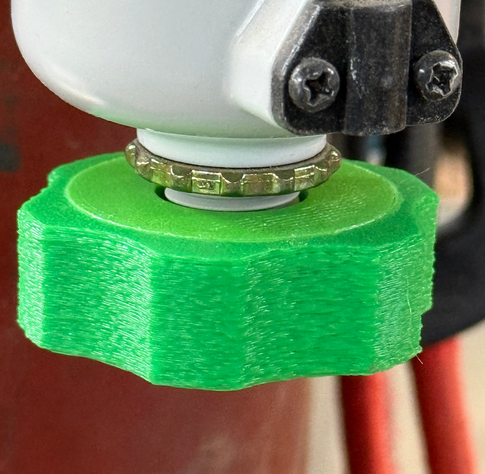

# Air Filter Torque Limiting Wrench
  
We found the stock knob on the SAF-400 air filter drain could be finger tightened and then if you left for a bit and came back, it wouldn't be finger loosen-able. Because of the shape of the knob and the fact that it's plastic, using a metal tool to assist in loosening it also risked marring the cap. So we made a plastic knob with torque-limited tightening in FreeCAD. It's a ratchet and pawl based torque limiter mechanism.  It was designed to be printed as 3 pieces on a tool changer printer (Snapmaker U1, Prusa XL, Vortek, Core One +INDX, etc). The center piece is PLA and the exterior and snap ring are PETG. It requires a well tuned printer to function correctly and even though the materials don't stick, they might still require a little bit of work to initially get separated and operational. 

[Also uploaded to Printables.](https://www.printables.com/model/1749688-torque-limiting-wrench-for-saf-400-series-air-filt)
